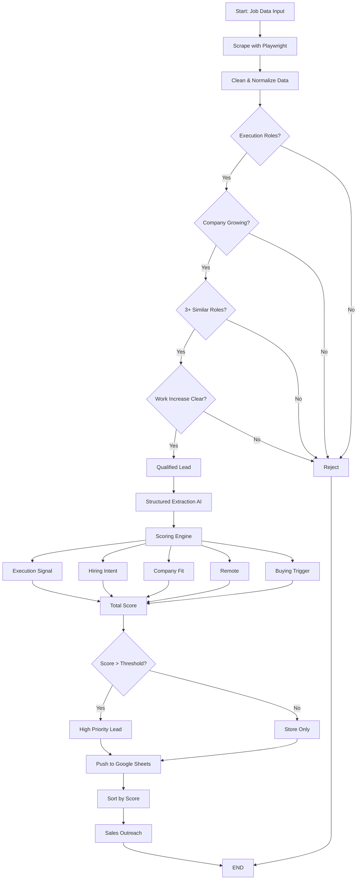

# Flow Diagram vs. Existing Code — Feature Analysis

## Flow Diagram Description

The uploaded flow diagram describes a **Job Lead Qualification Pipeline** with these sequential stages:



### Diagram Steps Summarized

| # | Diagram Step | Description |
|---|---|---|
| 1 | **Start: Job Data Input** | Entry point — receive job data |
| 2 | **Scrape with Playwright** | Use Playwright browser to scrape job listings |
| 3 | **Clean & Normalize Data** | Deduplicate and normalize text fields |
| 4 | **Execution Roles?** | Decision: Is the role an execution-type role? |
| 5 | **Company Growing?** | Decision: Is the company showing growth signals? |
| 6 | **3+ Similar Roles?** | Decision: Are there 3+ similar/same roles posted? |
| 7 | **Work Increase Clear?** | Decision: Is there a clear workload increase signal? |
| 8 | **Qualified Lead** | Lead passed all filters |
| 9 | **Structured Extraction AI** | AI-powered structured data extraction |
| 10 | **Scoring Engine** | Score the lead on 5 factors |
| 11 | **5 Scoring Factors** | Execution Signal, Hiring Intent, Company Fit, Remote, Buying Trigger |
| 12 | **Total Score** | Sum of all factor scores |
| 13 | **Score > Threshold?** | Decision: classify as High Priority or Store Only |
| 14 | **Push to Google Sheets** | Export qualified leads to Google Sheets |
| 15 | **Sort by Score** | Order leads by score descending |
| 16 | **Sales Outreach** | Final step — ready for outreach |
| 17 | **Reject** | Leads failing any filter step go to reject |
| 18 | **END** | Pipeline complete |

---

## Feature-by-Feature Comparison

### ✅ MATCHING Features (Diagram ↔ Code)

| # | Feature | Diagram | Code Implementation | Match Quality |
|---|---|---|---|---|
| 1 | **Scrape with Playwright** | ✅ Yes | ✅ `search_engine.py` — `fetch_jobs_playwright()` uses Playwright with stealth Chromium to scrape Google → LinkedIn | **Exact Match** |
| 2 | **Clean & Normalize Data** | ✅ Yes | ✅ `normalize()` function (line 1040) — deduplicates by ID, strips whitespace, normalizes text | **Exact Match** |
| 3 | **Execution Roles? (Step 1)** | ✅ Yes | ✅ `hard_filter()` Step 1 (line 327-341) — checks `SERVICEABLE_ROLES` and `REJECT_ROLES` against job title | **Exact Match** |
| 4 | **Company Growing? (Step 2)** | ✅ Yes | ✅ `hard_filter()` Step 2 (line 343-363) — rejects known enterprises, HR/staffing companies, enterprise signals | **Partial Match** — diagram says "Company Growing?" but code checks "Company Type" (not growth per se, but company suitability) |
| 5 | **3+ Similar Roles? (Step 3)** | ✅ Yes | ✅ `hard_filter()` Step 3 (line 366-375) — checks `company_open_roles ≥ 2` and `HIRING_PATTERN_SIGNALS` | **Partial Match** — diagram says "3+" but code threshold is `< 2` (i.e., needs at least 2 roles, not 3) |
| 6 | **Work Increase Clear? (Step 4)** | ✅ Yes | ✅ `hard_filter()` Step 4 (line 378-386) — checks `WORKLOAD_SIGNALS`, `VAGUE_SIGNALS`, and `CAPACITY_SIGNALS` | **Exact Match** |
| 7 | **Reject path** | ✅ Yes | ✅ Rejected leads stored in `rejected` list and `rejected` DB table with step/reason | **Exact Match** |
| 8 | **Qualified Lead** | ✅ Yes | ✅ Leads passing all filter steps enter `passed` list | **Exact Match** |
| 9 | **Scoring Engine — 5 Factors** | ✅ Yes | ✅ `score_lead()` (line 399-598) scores on exactly these 5 factors | **Exact Match** |
| 10 | **Execution Signal (0-3)** | ✅ Yes | ✅ Factor 1 in `score_lead()` (line 416-430) | **Exact Match** |
| 11 | **Hiring Intent (0-3)** | ✅ Yes | ✅ Factor 2 in `score_lead()` (line 432-450) | **Exact Match** |
| 12 | **Company Fit (0-2)** | ✅ Yes | ✅ Factor 3 in `score_lead()` (line 452-465) | **Exact Match** |
| 13 | **Remote Signal (0-2)** | ✅ Yes | ✅ Factor 4 in `score_lead()` (line 467-483) | **Exact Match** |
| 14 | **Buying Trigger (0-3)** | ✅ Yes | ✅ Factor 5 in `score_lead()` (line 485-507) | **Exact Match** |
| 15 | **Total Score** | ✅ Yes | ✅ `total = min(13, sum of all factors)` (line 509-510) | **Exact Match** |
| 16 | **Score > Threshold? → Priority** | ✅ Yes | ✅ `High` (≥10), `Medium` (≥7), `Low` (<7) from config thresholds (line 515-519) | **Exact Match** |
| 17 | **Sort by Score** | ✅ Yes | ✅ `passed.sort(key=lambda j: j["score"], reverse=True)` (line 1157) | **Exact Match** |

---

### ❌ NOT MATCHING / MISSING Features

| # | Feature | In Diagram? | In Code? | Gap Description |
|---|---|---|---|---|
| 1 | **Push to Google Sheets** | ✅ Yes | ❌ **Not implemented** | The diagram shows leads being "Pushed to Google Sheets" after scoring. The code saves to **SQLite DB** (`db_save()`) instead — there is **no Google Sheets integration** anywhere in the codebase. |
| 2 | **Sales Outreach** | ✅ Yes | ❌ **Not implemented** | The diagram shows a "Sales Outreach" step after sorting. The code has **no outreach/email/CRM functionality** — it ends at displaying leads in the Streamlit UI. |
| 3 | **Structured Extraction AI (before scoring)** | ✅ Yes (dedicated step) | ⚠️ **Partially implemented differently** | The diagram shows "Structured Extraction AI" as a **separate step** between qualifying and scoring. In the code, AI is integrated as **optional alternative paths** (`ai_hard_filter()`, `ai_score_lead()`, `ai_rewrite_reason()`), not as a dedicated structured extraction step. The AI upgrades are layered on top of the rule-based system, not a separate extraction stage. |
| 4 | **"Company Growing?" meaning** | ✅ Growth check | ⚠️ **Different focus** | The diagram implies checking if the company is **growing**. The code's Step 2 primarily checks if the company is a **known enterprise, HR/staffing firm, or consulting company** (rejection-based). Growth signals (`ICP_SCALING`) are only used during **scoring**, not during filtering. |

---

### 🔄 Features in CODE but NOT in DIAGRAM

| # | Feature | In Code? | In Diagram? | Description |
|---|---|---|---|---|
| 1 | **Step 5: Remote Compatibility Filter** | ✅ Yes | ❌ No | Code has a 5th hard filter step (line 388-394) checking `ONSITE_BLOCKERS` — "onsite-only → hard reject". The diagram does **not** show this as a filter gate. Remote appears only as a **scoring factor**. |
| 2 | **Multiple Data Sources** | ✅ Yes | ❌ No (only Playwright shown) | Code supports **5 sources**: Google→LinkedIn (Playwright), SerpApi, LinkedIn scraping, Indeed RSS, Remotive API. Diagram only shows "Scrape with Playwright". |
| 3 | **AI Filter Mode (Claude API)** | ✅ Yes | ❌ No | Code has `ai_hard_filter()` using Claude API as alternative to rule-based filtering. Not shown in diagram. |
| 4 | **AI Score Mode (Claude API)** | ✅ Yes | ❌ No | Code has `ai_score_lead()` using Claude API as alternative to rule-based scoring. Not shown in diagram. |
| 5 | **AI Reason Rewriter** | ✅ Yes | ❌ No | Code has `ai_rewrite_reason()` that rewrites buy-reasons using Signal→Meaning→Why formula. Not in diagram. |
| 6 | **SQLite Database Storage** | ✅ Yes | ❌ No (diagram shows Google Sheets) | Code saves to SQLite with duplicate prevention (3-layer). Diagram shows Google Sheets instead. |
| 7 | **View from DB Mode** | ✅ Yes | ❌ No | Code has a separate "View from DB" mode with filtering by keyword, priority, and min score. Not in diagram. |
| 8 | **Buy Reason Generation** | ✅ Yes | ❌ No | Code generates detailed "Why they will buy from VE" reasons using Signal→Meaning→Why formula. Not shown in diagram. |
| 9 | **Reject Company filter** | ✅ Yes | ⚠️ Partially | Code has `REJECT_COMPANIES` list in Step 2 to reject HR/staffing/recruiting/consulting companies. Diagram's "Company Growing?" doesn't clearly cover this. |
| 10 | **Reject Roles filter** | ✅ Yes | ⚠️ Partially | Code has `REJECT_ROLES` in Step 1 to reject capability roles (AI/ML, architect, C-suite). Diagram's "Execution Roles?" partially covers this. |

---

## Summary

### Overall Match Assessment

> [!IMPORTANT]
> The flow diagram represents approximately **70-75% of the actual implementation**. The core pipeline flow (scrape → filter → score → prioritize) matches well, but significant features in the code are absent from the diagram, and two diagram steps (Google Sheets, Sales Outreach) are **not implemented**.

### Key Gaps

```diff
+ MATCHING (Core Pipeline):
  Playwright scraping ✅
  Clean & Normalize ✅
  4 of 5 Filter gates ✅ (Step 5 Remote filter missing from diagram)
  5 Scoring factors ✅ (exact match)
  Score thresholding ✅
  Sort by score ✅
  Reject tracking ✅

- NOT MATCHING:
  Google Sheets export (diagram) → SQLite DB (code)
  Sales Outreach step (diagram) → Not implemented (code)
  Structured Extraction AI as separate step (diagram) → Optional AI modes (code)
  Company Growing filter (diagram) → Company Type/Enterprise rejection (code)
  Remote compatibility hard filter (code) → Missing from diagram
  Multiple data sources (code) → Only Playwright shown (diagram)
  AI filter/score/reason modes (code) → Not shown (diagram)
  Buy reason generation (code) → Not shown (diagram)
  View from DB mode (code) → Not shown (diagram)
```

### Recommendation

The diagram needs to be updated to accurately reflect the **current implementation** — particularly:
1. Add **Step 5 (Remote filter)** to the filter gates
2. Replace "Google Sheets" with **SQLite DB** storage
3. Remove or mark "Sales Outreach" as **planned/future**
4. Show **multiple data sources** (not just Playwright)
5. Add the **AI mode options** (optional filter/score/reason with Claude API)
6. Rename "Company Growing?" to something like "Company Type Check?" to match the actual rejection logic
